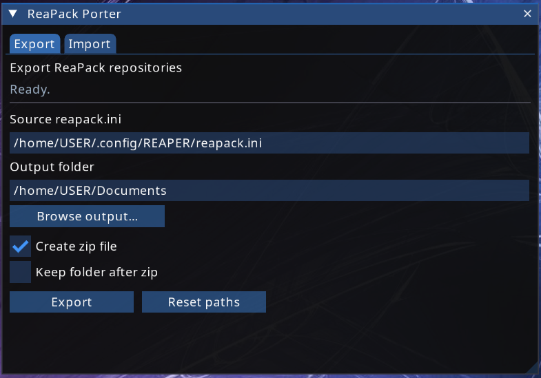
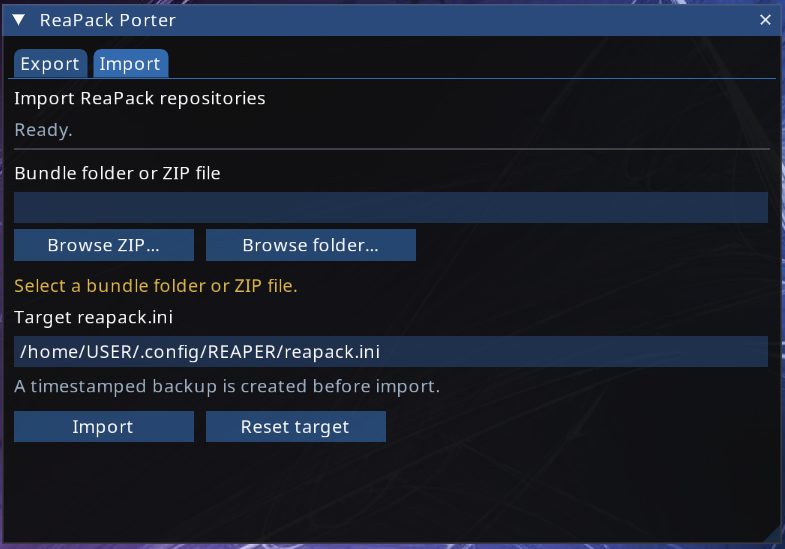

# ReaPack Porter

ReaPack Porter exports and imports REAPER ReaPack repository lists, allowing you to move your ReaPack setup between systems using one portable ZIP file.

## Current Status

ReaPack Porter is currently available as a Lua tool:

- a ReaScript GUI running inside REAPER
- a standalone Lua command-line interface

Exporting can safely be performed while REAPER is running.

Importing must be performed while REAPER is fully closed. REAPER and ReaPack may keep configuration data in memory and can ignore or overwrite changes made to `reapack.ini` during an active session.

A future release is planned as a standalone graphical application for Windows, Linux and macOS. That application is not available yet.

## Features

- Export ReaPack repositories from `reapack.ini`
- Create a portable ZIP for transfer by USB, network, email or cloud storage
- Import repositories from a ZIP file or exported folder
- Skip repository URLs that already exist
- Create a timestamped backup before import
- ReaImGui GUI inside REAPER with a simple dialog fallback
- Standalone Lua CLI mode for automation
- Automatic detection of the standard REAPER resource path
- Support explicitly supplied source and target paths

## Important Import Warning

> Close all running REAPER instances before importing repositories.

Do not import into `reapack.ini` while REAPER is running. The current in-REAPER interface is suitable for export, but a reliable import requires REAPER to be closed.

After importing:

1. Start REAPER.
2. Run `Extensions > ReaPack > Synchronize packages`.

## Dependencies

### Required

For the graphical interface:

- REAPER with Lua/ReaScript support

For command-line use:

- a standalone Lua interpreter

### Optional

- ReaImGui: enables the tabbed GUI inside REAPER
- js_ReaScriptAPI: enables folder browse dialogs
- `zip` and `unzip` on Linux and macOS
- PowerShell `Compress-Archive` and `Expand-Archive` on Windows

Without ReaImGui, the script falls back to REAPER's built-in dialogs.

Without ZIP tooling, folder export remains available as a fallback.

## Screenshots

These screenshots show the current ReaImGui version of ReaPack Porter running inside REAPER.





## REAPER Usage

1. Copy `reapack_porter.lua` into the REAPER Scripts folder.
2. Open `Actions > Show action list`.
3. Click `Load...`.
4. Select `reapack_porter.lua`.
5. Run the action.

When ReaImGui is installed, ReaPack Porter opens a tabbed GUI. Without ReaImGui, it falls back to REAPER's built-in dialogs.

Use this interface for export.

For import, close REAPER completely and use the standalone Lua CLI.

## CLI Usage

Export repositories:

```bash
lua reapack_porter.lua export --zip
```

Import repositories while REAPER is closed:

```bash
lua reapack_porter.lua import --bundle "/path/to/reapack-portable.zip"
```

Custom paths:

```bash
lua reapack_porter.lua export \
  --source "/path/to/reapack.ini" \
  --out "/path/to/output" \
  --zip
lua reapack_porter.lua import \
  --bundle "/path/to/bundle-or-folder" \
  --target "/path/to/reapack.ini"
```

## Import Safety

REAPER must be closed before import.

Existing repository URLs are detected and skipped. Only missing URLs are added.

A timestamped backup is created before writing, for example:

```text
reapack.ini.bak.20260529-161947
```

If a backup already exists for the same second, a suffix is added:

```text
reapack.ini.bak.20260529-161947-1
```

## Planned Standalone Application

The planned standalone ReaPack Porter application will replace the in-REAPER import workflow with a graphical application that runs independently from REAPER on Windows, Linux and macOS.

Expected goals:

- no ReaScript or ReaImGui requirement
- built-in ZIP handling
- explicit detection that REAPER is closed before import
- preservation of compatibility with existing ReaPack Porter export bundles
- graphical export and import workflow outside REAPER

This is planned work and has not been released yet.

## Disclaimer

ReaPack Porter is an independent companion utility for ReaPack. It is not affiliated with, maintained by or endorsed by the developers of REAPER or ReaPack.
